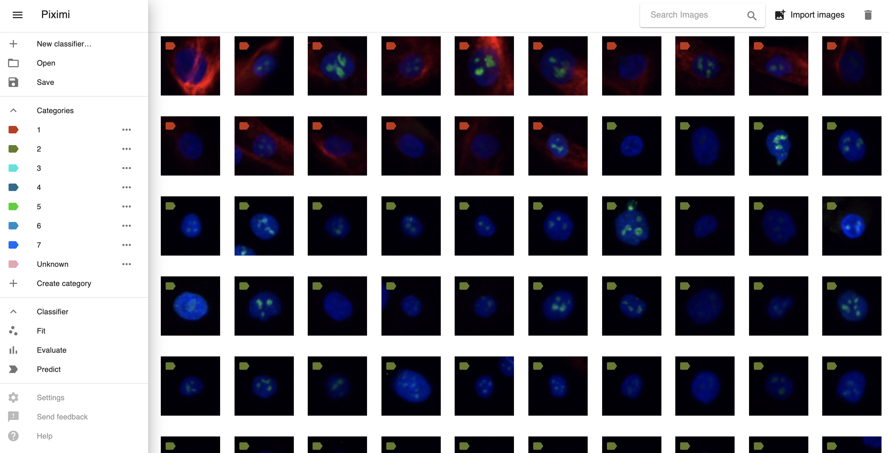

# Piximi

Piximi is a free, open source web app for performing image understanding tasks. It’s written by by dozens of engineers and scientists from institutions like the Biological Research Centre Szeged, Broad Institute of MIT and Harvard, Chan Zuckerberg Initiative, ETH Zurich, and FIMM Helsinki.

Piximi's target users are computational or non-computational scientists interested in image analysis from fields like astronomy, biology, and medicine.

## How can I use it?

👉 Just put this in your browser: [https://www.piximi.app/](https://www.piximi.app/)

### Our design philosophy

* No installations
* Everything happens inside your browser, locally
* Intuitive and interactive web interface
* Cutting-edge machine learning just by clicking


We are still in development, so please report all rough edges and issues to [https://github.com/piximi/piximi-issues](https://github.com/piximi/piximi-issues) 


## How can I contribute?

I'm glad you asked! Our team needs you. So we created a how to start guide to explain you Piximi and how to develop on it!

